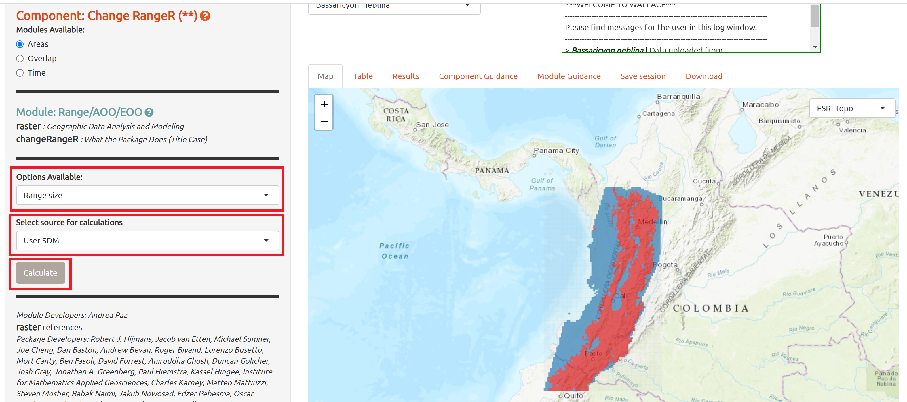
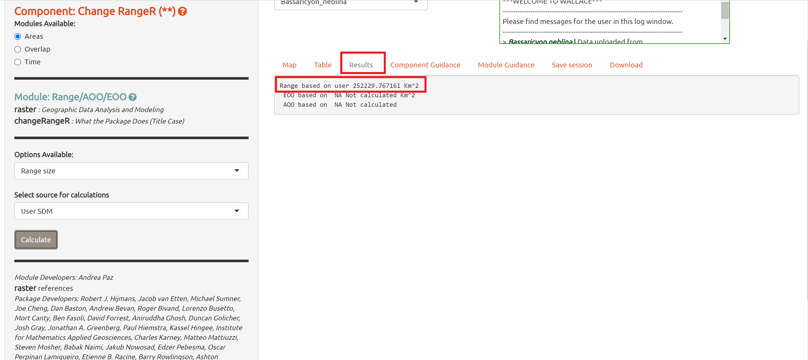
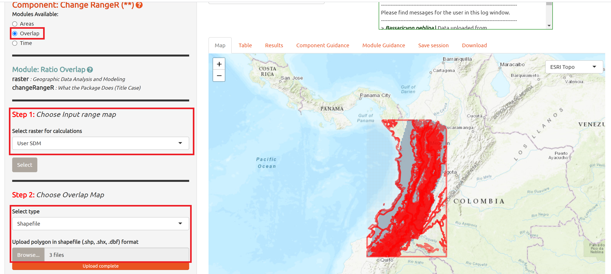
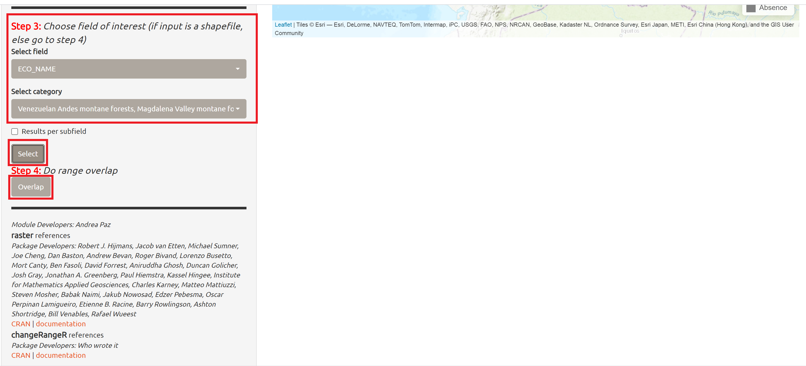
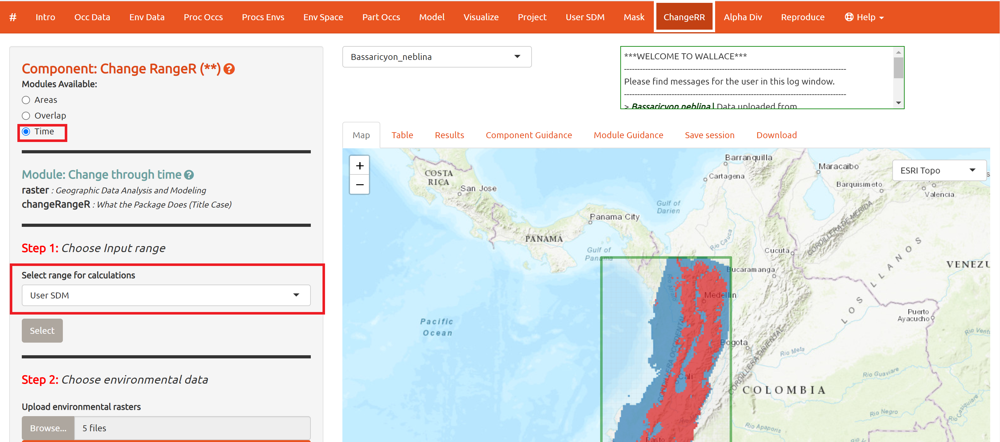
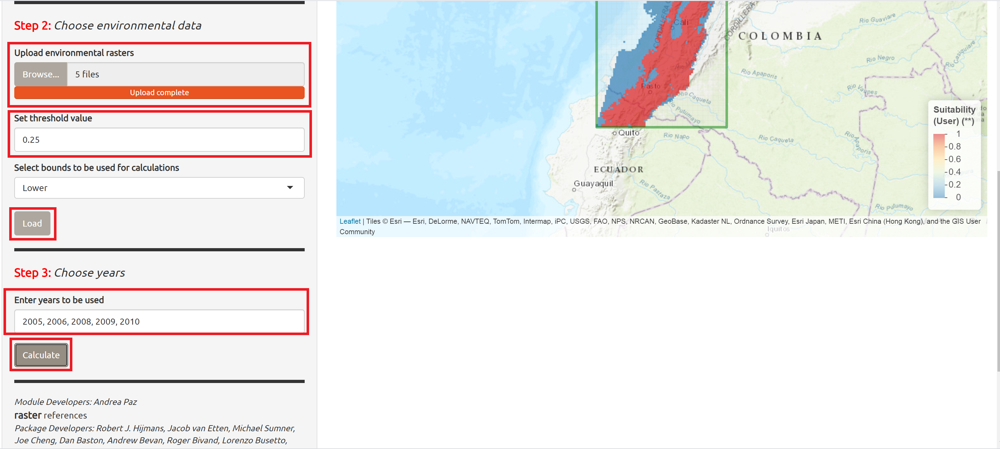
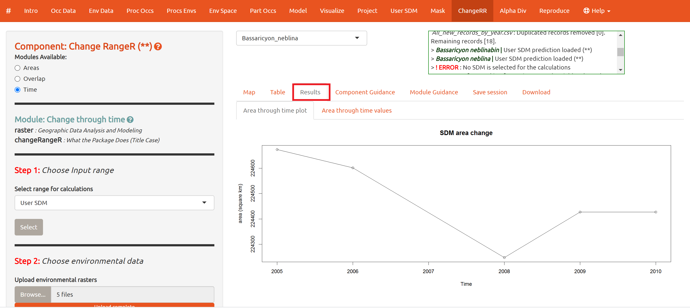
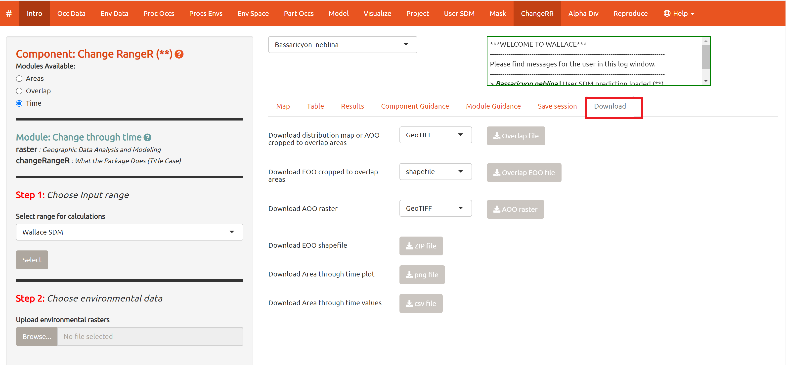

### Range Change Through Time Testing instructions.

### Overview 
  **_Change RR_** allows users to calculate several indicators relevant for conservation assessments based on occurrence localities and/or SDMs. Such indicators include range size estimates and IUCN Area of Occupancy (AOO) and Extent of Occurrence (EOO). Additionally, **_Change RR_** allows users to calculate the percentage of overlap between species' distributions and different spatial features (e.g, protected areas, mining) and estimate how range size may change over time given various spatial processes (e.g. deforestation, ecological footprint).

For more information about this component, please see our [demonstration video for single species analyses](https://youtu.be/mfBwqnate88)<br>

### Instructions  

Thank you for testing our development version. Before you begin, please follow the [Wallace v3 installation 
instructions](installation_instructions.md) and [Download the prepared datasets](Data.md). 

Please find instructions for beta testing of the new functionalities within the **_Change RR_** component below. You may choose to test all of these functionalities or either of them separately. You *do not* need to follow them sequentially though this is strongly recommended.

1. [Running Wallace](#Running Wallace)<br>

2. [Upload data & SDMs](#Upload data & SDMs)<br> 

3. [Test: Calculate areal indicators](#Test: Calculate areal indicators)<br>

4. [Test: Calculate geographic overlap indicators](#Test: Calculate geographic overlap indicators)<br>

5. [Test: Calculate temporal trends](#Test: XYZ)<br>

6. [Download outputs](#Download outputs)<br>

### 1. Running Wallace <a name = "Running Wallace"> </a>

  * Open your R studio and run these lines of code in the console: 
```{r}
library(wallace)
run_wallace()
```
 * Wallace should automatically open in your default browser (e.g., Google Chrome, Safari, Firefox).<br>
 
### 2. Upload data & SDMs <a name = "Upload data & SDMs"> </a>

#### Upload Occurrence data  

  * Navigate to the **_Occ Data_** tab on the top menu bar.  

  * Select the "**User-specified**" option on the side menu and upload the *All_new_records_by_year.csv* occurrence data file.  

 
  
####  Upload an SDM  

  * In addition to providing tools for users to build SDMs, *Wallace* now allows users to upload their own SDMs as raster files. To do so, navigate to the **_User SDM_** tab on the top menu. 

  * Select **Upload User SDM** on the side menu and load the *Bassaricyon_neblinabin.tif* file that you downloaded - it is inside the *olinguito.zip* file. 

  * Click **Load SDM**. This should upload a binary (thresholded) model for *Brassaricyon neblina*, a small carnivore known as the Olinguito.<br>  
  
  
  
  * **Note:** Though binary (thresholded) models are needed for *Area* calculations, continuous models may also be used for calculations in the *Overlap* and *Time* modules.  
  
   * **Note**: **_Change RR_** is also capable of using outputs from the **_Mask_** component as inputs. 
  
### 3. Test: Calculate areal indicators <a name = "Test: Calculate areal indicators"> </a>

* Go to the "**_Change RR_**" tab in the top menu and choose the "**Areas**" option in the side menu.

#### Using SDMs 

##### Range Size

* Use the **Options Available** drop-down menu to select "*Range size*". and select "*User SDM*" as the **Source for calculations**. 

* Click the "**Calculate**" button.



* **Note:** The **Areas** module also allows for area calculations from a *Wallace* model, a projected *Wallace* model, or a masked model (made in "**_Mask_**). <br>

* Go to the **Results** tab in the results panel to visualize area calculations.



##### Extent of Occurrence (EOO)

* Use the **Options Available** drop-down menu to select "*EOO*" and select "*User SDM*" as the **Source for calculations**. 

* Click the "**Calculate**" button. View the results tab for the calculation of EOO area based on an SDM.

##### Area of Occupancy (AOO)

* Use the **Options Available** drop-down menu to select "*AOO*" and select "*User SDM*" as the **Source for calculations**. 

* Click the "**Calculate**" button. View the results tab for the calculation of AOO area based on an SDM.

#### Using IUCN methods

All areal indicators can also be calculated via standard IUCN methods. Below we outline an example calculating EOO, however, note that this may be done for all available metrics. 

##### Extent of Occurrence (EOO)

  * Use the **Options Available** drop-down menu to select "*EOO*" and select "*Occurrences*" as the **Source for calculations**. 

  * Click the "**Calculate**" button. 

  * View the results tab for the calculation of EOO area based on a minimum convex polygon around the specie's occurrences (the standard IUCN method). <br> 

### 4. Test: Calculate geographic overlap indicators <a name = "Test: Calculate geographic overlap indicators"> </a>

  * In **_Change RR_**, select **Overlap** option in the side menu. 

  * Scroll down to **Step 1: Choose Input range map** and select *User SDM* from the drop-down menu. 

  * In **Step 2: Choose Overlay map**, use the drop-down menu to select file type "*Shapefile*" and upload the *SA_Ecoregions_WWF* shapefile you downloaded. Remember to select all three files (.shp, shx, .dbf).
  
  * Click the "**Load**" button.
  
  

  * Scroll down to **Step 3: fields of interest** , and use the drop-down menu to select "*ECO_NAME*".
  
  * Open the drop-down **Select Category** menu. First click "*Deselect all*" and then select the 5 available options "montane forests":
    - Cauca Valley montane forest 
    - Magdalena Valley montane forest
    - Eastern Cordillera real montane forests
    - Cordillera Oriental montane forest
    - Northwestern Andean montane forests

  * Click "**Select**". Then scroll down to **Step 4: Do range overlap** and click the **Overlap** button.  
  


  * Click the "**Results**" tab to view the percentage of range within montane forests. <br>

  * **Note**: You may also try this function to find the overlap of the species' range with protected areas. To do so, use the "*WDPA_COL_olinguito.shp*" in the "parks.zip" file from the that you downloaded. <br>

### 5. Test: Calculate temporal trends <a name = "Test: Calculate temporal trends"> </a>

  * In **_Change RR_**, select **Time** option in the side menu.
  
  * Use the drop-down menu in **Step 1: Choose input range** to select "*User SDM*" and click "**Select**".
  

  
  * Scroll down to **Step 2: Choose environmental variables** and upload the 5 MODIS Vegetation Continuous Fields (VCF) rasters you previously downloaded (in the *olinguito.zip* file). 
  
  * Set the threshold value for the species - in this case, we'll try a threshold forest cover for the olinguito of 0.25. 
  
  * Click the "**Load**" button.

  * Scroll down to **Step 3: Choose years** and enter all five years of the MODIS VCF rasters available in the testing data set. The years must listed separated by commas (i.e., 2005, 2006, 2008, 2009,2010). 
  
  * **Note:** You may enter any number of years for which you wish to calculate changes in range over time. 
  

  
  
  * Click "**Calculate**". 
  
  * Go to the "**Results**" tab in the results panel to visualize how the range of the species has changed overt time given changes in the provided environmental layers - in this case, changes in forest cover.



### 6. Download outputs <a name = "Download outputs"> </a>

  *  To download your output files, navigate to the "**Download**" tab in the results panel. 
  
  * When applicable, use the drop-down menu to select your preferred output file type and click on the download button.<br>


