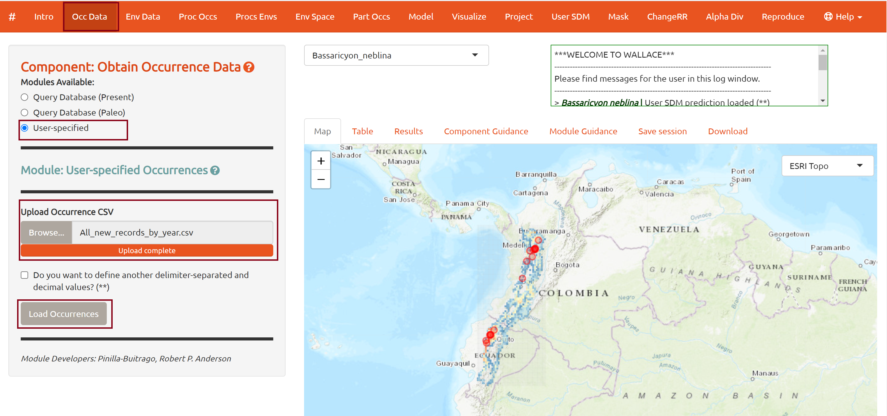
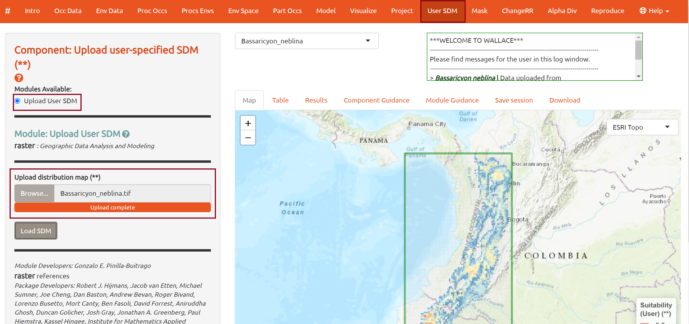
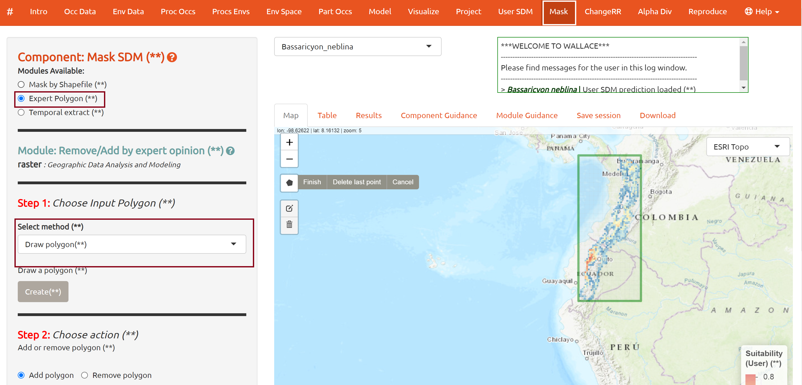
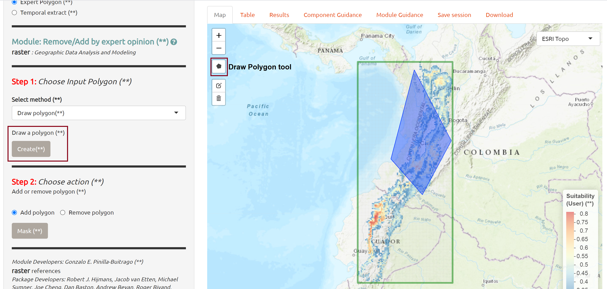
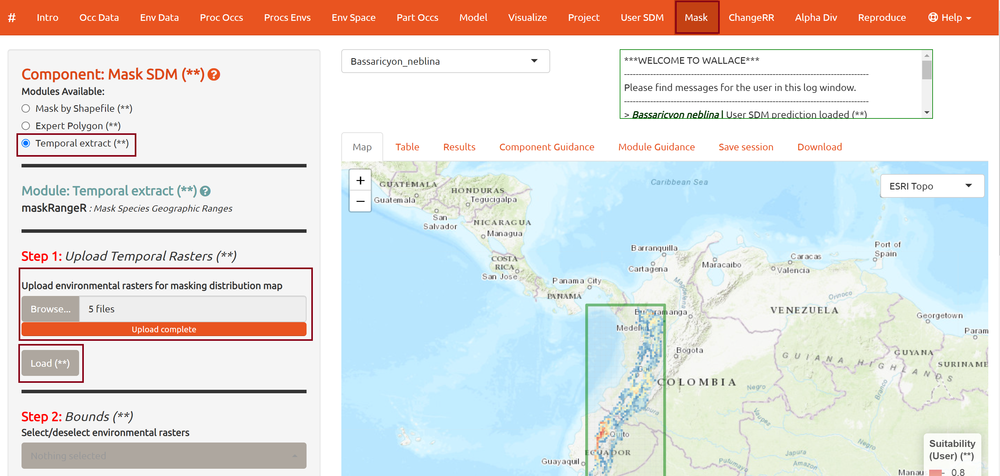
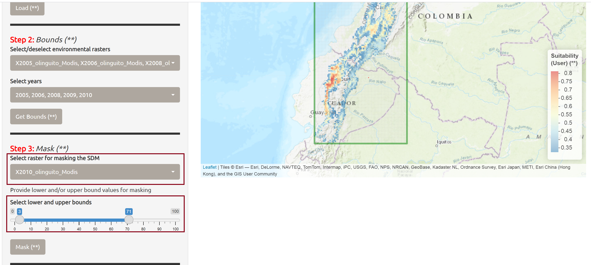
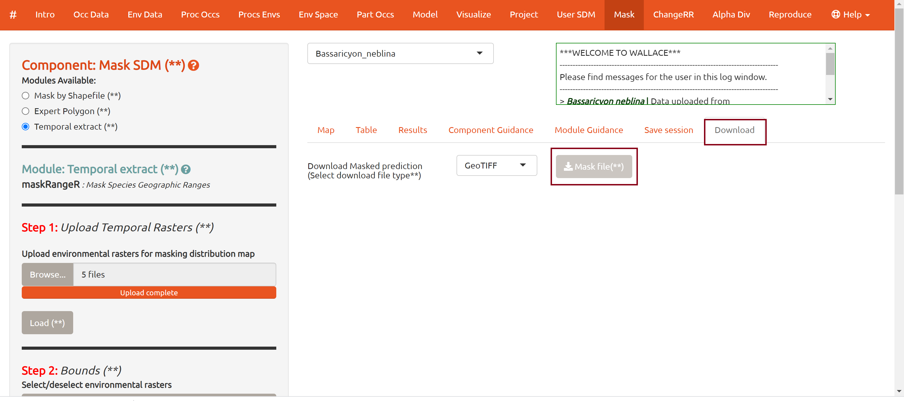

## Mask in Wallace  

### Overview

**_Mask_** allows users to post-process the SDM you made in *Wallace* or imported with **_UserSDM_**.  Users are given the option to mask using user-specified shapefiles, expert opinions, or remote sensing data. Additionally, **_Mask_** allows users to temporally match species occurrence records with remote sensing data (e.g., annual forest cover).
  
For more information about this component, please see our [video: maskRangeR demonstration in Wallace](https://youtu.be/uBbYqQLRirU). 

### Instructions  

Thank you for testing our development version. Before you begin, please follow the [Wallace v3 installation 
instructions](installation_instructions.md) and [Download the prepared datasets](Data.md).  

Please find instructions for beta testing of the new functionalities within the **_Mask_** component below. You may choose to test all of these functionalities or either of them separately. You *do not* need to follow them sequentially though this is strongly recommended.   

1. [Running Wallace](#Running Wallace)<br>

2. [Upload data & SDMs](#Upload data & SDMs)<br> 

3. [Test: Masking SDMs with shapefiles](#Test: Masking SDMs with shapefiles)<br>

4. [Test: Masking SDMs using expert polygons](#Test: Masking SDMs using expert polygons)<br>

5. [Test: Mask an SDM by temporally matching with Remote Sensing data](#Test: Mask an SDM by temporally matching with Remote Sensing data)<br>

6. [Download Mask](#Download Mask)<br>

### 1. Running Wallace <a name = "Running Wallace"> </a>

  * Open your R studio and run these lines of code in the console: 
  
```{r}
library(wallace) 
run_wallace(biomodelos=TRUE) 
```

  * Wallace should automatically open in your default browser (e.g., Google Chrome, Safari, Firefox).<br>
  

### 2. Upload data & SDMs <a name = "Upload data & SDMs"> </a>

#### Upload Occurrence data  

  * Navigate to the **_Occ Data_** tab on the top menu bar.  

  * Select the "**User-specified**" option on the side menu and upload the *All_new_records_by_year.csv* occurrence data file. These data will be used to test the **_Mask: temporal extract_** module.    

{width=90%}  

  * **Note**: When attempting to use the **Temporal extract** module with your own data, you must ensure that the occurrence .csv file provided includes a "**year**" column, with dates matching those of the MODIS data that you will upload in that module.  
  
####  Upload an SDM  

  * In addition to providing tools for users to build SDMs, *Wallace* now allows users to upload their own SDMs as raster files. To do so, navigate to the **_User SDM_** tab on the top menu. 

  * Select **Upload User SDM** on the side menu and load the *Bassaricyon_neblina.tif* file that you downloaded - it is inside the *olinguito.zip* file. 

  * Click **Load SDM**. This should upload a continuous model for *Brassaricyon neblina*, a small carnivore known as the Olinguito.<br>   

{width=90%}


**Note**: All of the **_Mask_** modules can be executed using continuous model predictions. However, some **_ChangeRR_** functions (e.g., area calculations) will require a binary (thresholded) models.   

If you also wish to test **_ChangeRR_** we suggest you use a thresholded model here instead. Make sure any model you upload in **_User SDM_** is projected and has the same name as the scientific name of your species occurrence csv file. <br>  

### 3. Test: Masking SDMs with shapefiles <a name = "Test: Masking SDMs with shapefiles"> </a>

  * Navigate to the **_Mask_** tab on the top menu.  
  
  * Select **Mask by Shapefile** option in the sidebar and upload the *SA_Ecoregions_WWF* shapefile. This is WWF's Terrestrial Ecoregions of the World.Note that you must upload **all three** files (.shp, .shx, .dbf).  

**INSERT IMAGE OF WHERE THE COMPONENT & MODULE ARE**

  * Click "**Load**". 
  
  * You may see an error message- don't worry, just click "**OK**". Wallace is giving you a warning: 

```{r}
! WARNING:Bassaricyon neblina cloglog | Projection not found for shapefile. It is assume that shapefile datum is WGS84 (**) 
```

  * Scroll down to **Step 2: Select Field:** and select "*ECO_NAME*". 
  
  * Open the drop-down **Select Category** menu. First click "*Deselect all*" and then select the 5 available options "montane forests".   

**NOTE**: Blue sections will be removed, yellow will be kept. 

  * Select Attribute:

    - Cauca Valley montane forest 
    - Magdalena Valley montane forest
    - Eastern Cordilla real montane forests
    - Cordilla Oriental montane forest
    - Northwestern Andean montane forests 

  * Click "**Mask**". This may take a few minutes. 

  * You can then download your masked projection, continue masking, or move on to calculate indicators in **_ChangeRR_**. <br>


### 4. Test: Masking SDMs using expert polygons<a name = "Test: Masking SDMs using expert polygons"> </a>  

  * Navigate to the **_Mask_** tab in the top menu bar and select "**Expert Polygon**" in the side bar.    

  * Scroll down to **Step 1: Choose Input Polygon** and select *Draw Polygon* from the drop-down menu.<br>  
  
  {width=90%}

  * Click on the polygon drawing tool on the map to create your own polygon. To close the polygon, make sure you click on the first vertex created. 

  * Once you have created a polygon to your satisfaction, click the "**Create**" button.<br> 

{width=90%}<br>

  * Scroll down to **Step 2: Choose action** and select "Remove polygon", then click the "**Mask**" button.  
  
  * **Note**: When working with a continuous model prediction, you may only remove polygons. However, you can add or remove a polygon to a thresholded (binary) model prediction.<br>  

### 5. Test: Mask an SDM by temporally matching with remote sensing data <a name = "Test: Mask an SDM by temporally matching with remote sensing data"> </a> 
  
  * Navigate to the **_Mask_** tab in the top menu and then select "**Temporal extract**" in the side menu.  

  * Scroll down to **Step 1: Upload Temporal Rasters** to upload environmental rasters for masking distribution: Select the 5 following MODIS Vegetation Continuous Fields (VCF) files: 
  
      + 2005_olinguito_Modis.tif  
      
      + 2006_olinguito_Modis.tif  
      
      + 2008_olinguito_Modis.tif  
      
      + 2009_olinguito_Modis.tif  
      
      + 2010_olinguito_Modis.tif  
  
  * Click the "**Load**" button.<br>

{width=90%}  

  * Scroll down to **Step 2: Bounds** to select the temporal time frame for which we will match our occurrence data. 
  
  * Select only the years *2005, 2006, 2008, 2009, 2010*. These are the years for which we have both MODIS VCF data and occurrence data. 

  * **Note** Make sure you have previously uploaded the *All_new_records_by_year.csv*. 

  * Click the "**Get Bounds**" button to get the distribution of MODIS VCF values corresponding to your occurrence points. These results can guide the selection of the upper and lower bounds for these values to create the SDM mask.<br>

  

  * Scroll down to **Step 3: Mask** and select the *2010_olinguito_Modis.tif* raster. This raster will be used to create a masking layer based on user-defined upper and lower MODIS VCF values. 

  * Use the sliding bar to select upper and lower bounds for the MODIS VCF values you consider reasonable for the species. Note, that the Olinguito is strictly associated to cloud forests.<br> 

  

  * Click "**Mask**" to remove areas from your SDM with MODIS VCF values that are not within the bounds of what is considered suitable for the Olinguito.<br> 

{width=90%} <br>

### 6. Download Mask<a name = "Download Mask"> </a>

  * To download the masked SDM, navigate to the "**Download**" tab in the results panel. Use the drop-down menu to select your preferred output file type and click on "**Mask file**" to download.<br>

  

  * If you want to continue testing **_ChangeRR_**, you can navigate to it on the top menu bar and follow [testing instructions](crr.md). 
